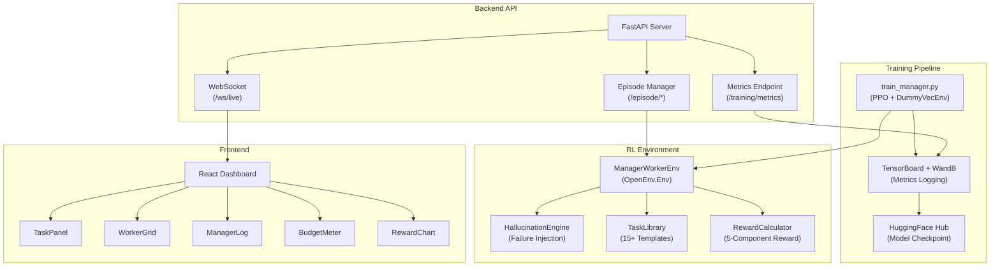
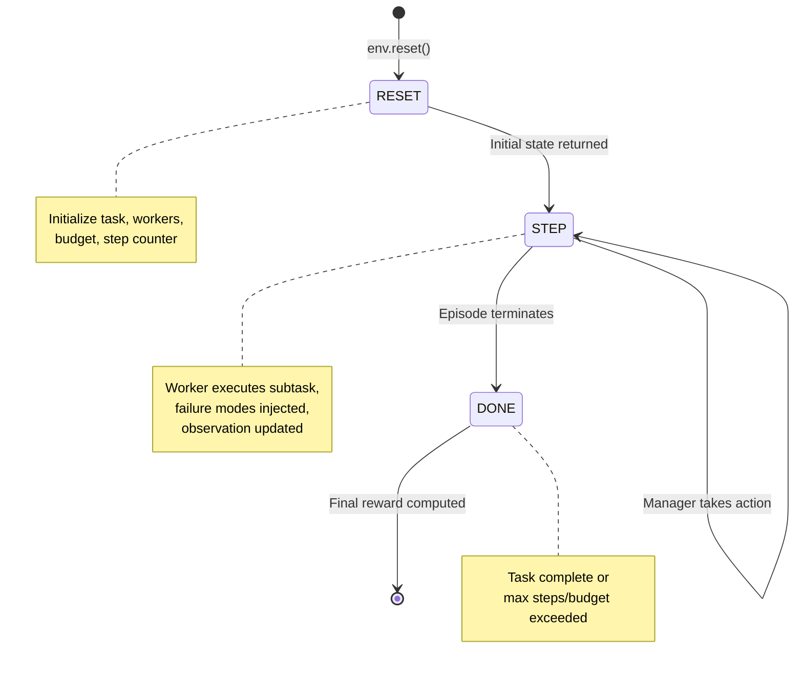
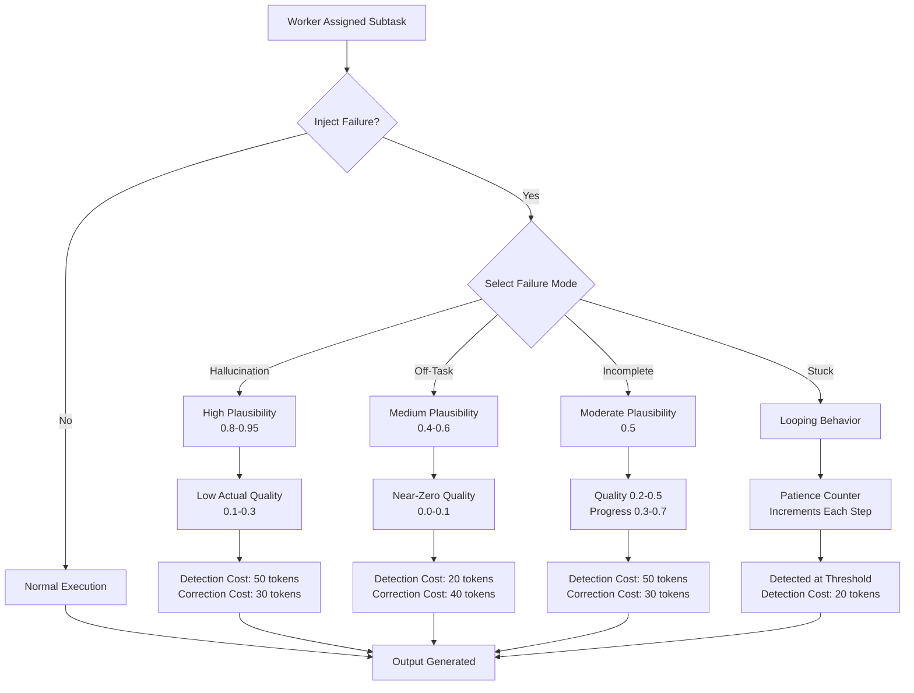
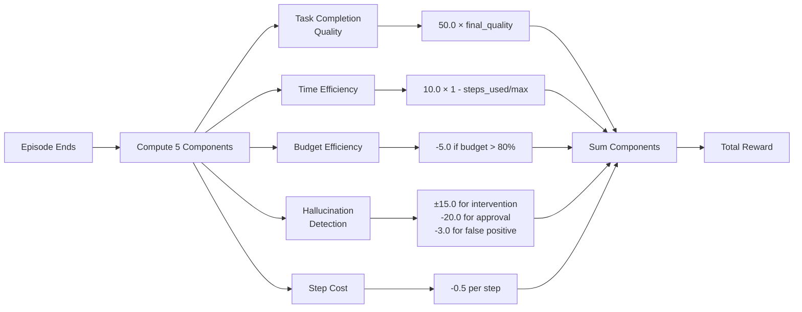
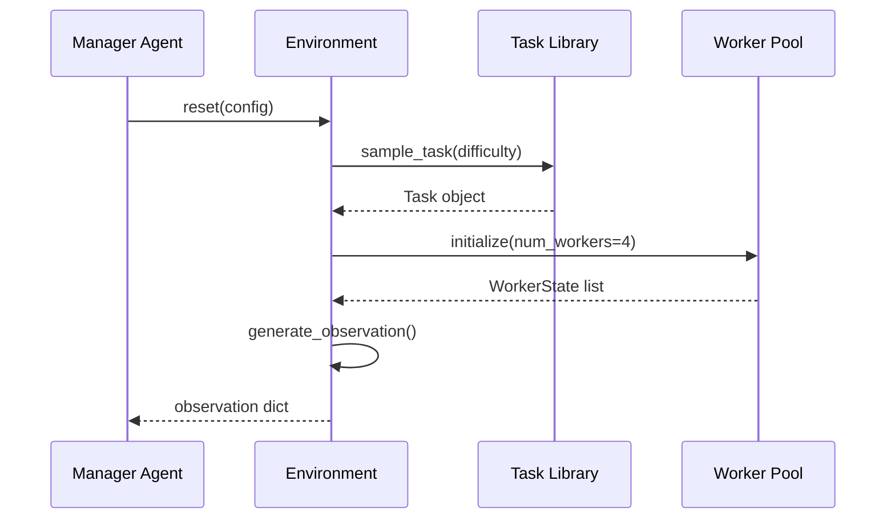
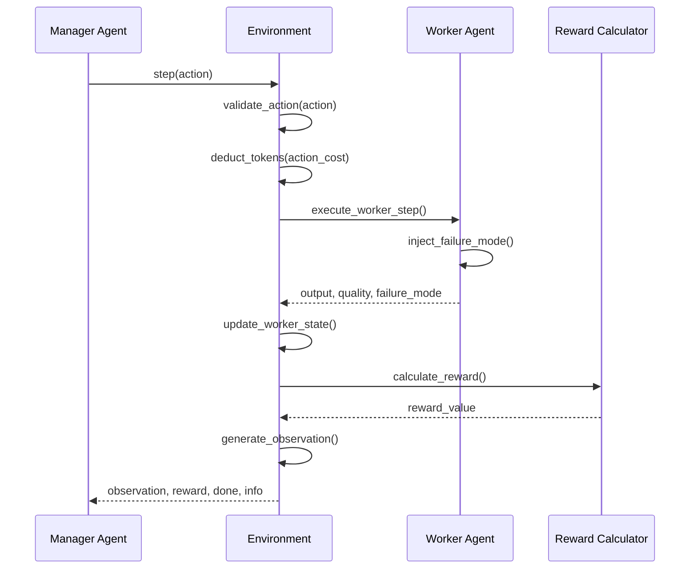

# Design Document: AI Manager + Worker Multi-Agent RL Environment

## Overview

This document specifies a reinforcement learning training environment built on the OpenEnv framework that simulates a workplace with one Manager Agent coordinating multiple Worker Agents to complete complex multi-step tasks. The environment injects realistic failure modes—hallucinations (plausible but incorrect outputs), off-task behavior, incomplete work, and stuck loops—forcing the Manager to learn detection and correction strategies under a limited token budget. The system includes a FastAPI backend for episode management, real-time WebSocket updates, and a React dashboard for visualization.

## Architecture



## Environment State Machine



## Core Interfaces and Data Structures

### Environment Class Interface

```python
class ManagerWorkerEnv(gym.Env):
    """
    Multi-agent RL environment with Manager coordinating Workers.
    
    Inherits from openenv.Env and implements standard gym interface.
    """
    
    def __init__(self, config: Dict[str, Any]) -> None:
        """
        Initialize environment with configuration.
        
        Args:
            config: Dictionary with keys:
                - max_workers: int (default 4, range 1-4)
                - max_steps: int (default 50, range 10-100)
                - token_budget: int (default 1000, range 500-5000)
                - task_difficulty: int (default 3, range 1-5)
                - failure_injection_rate: float (default 0.6, range 0.0-1.0)
        """
        pass
    
    def reset(self) -> Dict[str, np.ndarray]:
        """
        Reset environment to initial state.
        
        Returns:
            observation: Dictionary with keys:
                - task_embedding: np.ndarray shape (64,), dtype float32, range [-1, 1]
                - worker_states: np.ndarray shape (4, 5), dtype float32
                - subtask_status: np.ndarray shape (4,), dtype int32, values {0, 1}
                - budget_remaining: float, range [0, 1]
                - steps_remaining: float, range [0, 1]
        """
        pass
    
    def step(self, action: int) -> Tuple[Dict, float, bool, Dict]:
        """
        Execute one step of environment.
        
        Args:
            action: int in range [0, 6], representing discrete action
        
        Returns:
            observation: Updated observation dictionary
            reward: float, cumulative reward for this step
            done: bool, True if episode terminates
            info: Dict with metadata (task_quality, tokens_used, etc.)
        """
        pass
    
    def render(self, mode: str = 'human') -> Optional[str]:
        """
        Render environment state for visualization.
        
        Args:
            mode: 'human' for console, 'rgb_array' for image
        
        Returns:
            Rendered output or None
        """
        pass
```

### Observation Space Specification

```python
observation_space = Dict({
    'task_embedding': Box(
        low=-1.0, high=1.0,
        shape=(64,), dtype=np.float32
    ),
    'worker_states': Box(
        low=0.0, high=1.0,
        shape=(4, 5), dtype=np.float32
        # Columns: [is_active, progress, hallucination_risk, output_quality, tokens_consumed_ratio]
    ),
    'subtask_status': MultiBinary(4),
        # Binary array: 1 if subtask complete, 0 otherwise
    'budget_remaining': Box(
        low=0.0, high=1.0,
        shape=(1,), dtype=np.float32
    ),
    'steps_remaining': Box(
        low=0.0, high=1.0,
        shape=(1,), dtype=np.float32
    )
})
```

### Action Space Specification

```python
action_space = Discrete(7)

# Action Mapping:
# 0: assign_subtask(worker_id, subtask_id) - 10 tokens
# 1: check_worker_output(worker_id) - 50 tokens
# 2: correct_worker(worker_id, correction) - 30 tokens
# 3: reassign_task(worker_id, new_subtask) - 40 tokens
# 4: fire_and_replace(worker_id) - 100 tokens
# 5: approve_output(worker_id) - 5 tokens
# 6: request_clarification(worker_id) - 20 tokens
```

### Worker State Structure

```python
@dataclass
class WorkerState:
    """Represents state of a single worker agent."""
    
    worker_id: int
    is_active: bool
    current_subtask_id: Optional[int]
    progress: float  # 0.0 to 1.0
    hallucination_risk_score: float  # 0.0 to 1.0
    output_quality_if_checked: float  # 0.0 to 1.0
    tokens_consumed: int
    failure_mode: Optional[str]  # 'hallucination', 'off_task', 'incomplete', 'stuck', None
    output_buffer: str  # Current output being generated
    patience_counter: int  # For detecting stuck loops
```

### Task Structure

```python
@dataclass
class Task:
    """Represents a task to be completed."""
    
    task_id: str
    task_type: str  # e.g., 'build_landing_page', 'market_research'
    description: str
    subtasks: List[Subtask]
    difficulty: int  # 1-5
    quality_eval_fn: Callable[[str], float]  # Returns quality score 0-1
    estimated_tokens: int
    
@dataclass
class Subtask:
    """Represents a subtask within a task."""
    
    subtask_id: int
    description: str
    expected_output_format: str
    quality_threshold: float  # Minimum acceptable quality
```


## Failure Mode Decision Tree



### Failure Mode Specifications

```python
@dataclass
class FailureMode:
    """Specification for a failure mode."""
    
    mode_type: str  # 'hallucination', 'off_task', 'incomplete', 'stuck'
    surface_plausibility: float  # How correct output appears
    actual_quality: float  # True quality of output
    detection_cost: int  # Tokens to detect via check_worker_output
    correction_cost: int  # Tokens to correct via correct_worker
    description: str

# Failure Mode Instances
HALLUCINATION = FailureMode(
    mode_type='hallucination',
    surface_plausibility=0.85,  # Random in [0.8, 0.95]
    actual_quality=0.2,  # Random in [0.1, 0.3]
    detection_cost=50,
    correction_cost=30,
    description='Output looks correct but contains subtle errors'
)

OFF_TASK = FailureMode(
    mode_type='off_task',
    surface_plausibility=0.5,  # Random in [0.4, 0.6]
    actual_quality=0.05,  # Random in [0.0, 0.1]
    detection_cost=20,
    correction_cost=40,
    description='Worker produces output unrelated to subtask'
)

INCOMPLETE = FailureMode(
    mode_type='incomplete',
    surface_plausibility=0.5,  # Random in [0.5, 0.6]
    actual_quality=0.35,  # Random in [0.2, 0.5]
    detection_cost=50,
    correction_cost=30,
    description='Output is partial or missing key components'
)

STUCK = FailureMode(
    mode_type='stuck',
    surface_plausibility=0.0,
    actual_quality=0.0,
    detection_cost=20,
    correction_cost=100,
    description='Worker loops without progress'
)
```

## Reward Calculation Flow



### Reward Function Specification

```python
def calculate_reward(
    final_quality: float,
    steps_used: int,
    max_steps: int,
    tokens_used: int,
    token_budget: int,
    hallucination_interventions: int,
    hallucination_approvals: int,
    false_positives: int
) -> float:
    """
    Calculate cumulative reward for episode.
    
    Preconditions:
        - 0 <= final_quality <= 1.0
        - 0 <= steps_used <= max_steps
        - 0 <= tokens_used <= token_budget
        - All intervention counts >= 0
    
    Postconditions:
        - Returns float reward value
        - Reward components are additive
        - Higher quality and efficiency yield higher rewards
        - Hallucination detection is incentivized
    
    Loop Invariants: N/A (no loops)
    """
    
    # Component 1: Task completion quality (0-50 points)
    quality_reward = 50.0 * final_quality
    
    # Component 2: Time efficiency (0-10 points)
    time_efficiency = 1.0 - (steps_used / max_steps)
    time_reward = 10.0 * time_efficiency
    
    # Component 3: Budget efficiency penalty
    budget_ratio = tokens_used / token_budget
    budget_reward = -5.0 if budget_ratio > 0.8 else 0.0
    
    # Component 4: Hallucination detection
    hallucination_reward = (
        15.0 * hallucination_interventions  # Correct detections
        - 20.0 * hallucination_approvals    # Approving hallucinations
        - 3.0 * false_positives             # False alarms
    )
    
    # Component 5: Step cost
    step_cost = -0.5 * steps_used
    
    total_reward = (
        quality_reward +
        time_reward +
        budget_reward +
        hallucination_reward +
        step_cost
    )
    
    return total_reward
```

## Task Library

```python
TASK_LIBRARY = [
    Task(
        task_id='build_landing_page',
        task_type='web_development',
        description='Build a responsive landing page with hero section, features, and CTA',
        subtasks=[
            Subtask(0, 'Design layout', 'HTML structure', 0.7),
            Subtask(1, 'Style with CSS', 'CSS file', 0.7),
            Subtask(2, 'Add interactivity', 'JavaScript', 0.6),
            Subtask(3, 'Test responsiveness', 'Test report', 0.8),
        ],
        difficulty=2,
        quality_eval_fn=lambda output: evaluate_landing_page(output),
        estimated_tokens=800
    ),
    Task(
        task_id='market_research',
        task_type='research',
        description='Conduct market research for a new product category',
        subtasks=[
            Subtask(0, 'Identify competitors', 'Competitor list', 0.7),
            Subtask(1, 'Analyze market size', 'Market analysis', 0.8),
            Subtask(2, 'Survey target users', 'Survey results', 0.7),
            Subtask(3, 'Compile report', 'Final report', 0.8),
            Subtask(4, 'Present findings', 'Presentation', 0.7),
        ],
        difficulty=3,
        quality_eval_fn=lambda output: evaluate_research(output),
        estimated_tokens=1200
    ),
    Task(
        task_id='debug_codebase',
        task_type='software_engineering',
        description='Debug and fix issues in a provided codebase',
        subtasks=[
            Subtask(0, 'Identify bugs', 'Bug list', 0.8),
            Subtask(1, 'Write test cases', 'Test suite', 0.8),
            Subtask(2, 'Fix bugs', 'Fixed code', 0.9),
            Subtask(3, 'Verify fixes', 'Test results', 0.9),
        ],
        difficulty=4,
        quality_eval_fn=lambda output: evaluate_debugging(output),
        estimated_tokens=1500
    ),
    Task(
        task_id='plan_product_launch',
        task_type='product_management',
        description='Plan a comprehensive product launch strategy',
        subtasks=[
            Subtask(0, 'Define launch goals', 'Goals document', 0.7),
            Subtask(1, 'Create timeline', 'Timeline', 0.8),
            Subtask(2, 'Plan marketing', 'Marketing plan', 0.7),
            Subtask(3, 'Identify risks', 'Risk assessment', 0.8),
            Subtask(4, 'Create launch checklist', 'Checklist', 0.8),
        ],
        difficulty=4,
        quality_eval_fn=lambda output: evaluate_launch_plan(output),
        estimated_tokens=1400
    ),
    Task(
        task_id='write_research_paper',
        task_type='academic',
        description='Write a research paper on a technical topic',
        subtasks=[
            Subtask(0, 'Literature review', 'Review document', 0.8),
            Subtask(1, 'Outline paper', 'Outline', 0.7),
            Subtask(2, 'Write sections', 'Draft', 0.8),
            Subtask(3, 'Add citations', 'Cited draft', 0.9),
            Subtask(4, 'Proofread', 'Final paper', 0.9),
        ],
        difficulty=5,
        quality_eval_fn=lambda output: evaluate_paper(output),
        estimated_tokens=2000
    ),
    # ... 10 more task templates following same pattern
]
```

## Key Functions with Formal Specifications

### Function 1: Worker Execution

```python
def execute_worker_step(
    worker: WorkerState,
    subtask: Subtask,
    failure_injection_rate: float
) -> Tuple[str, float, Optional[str]]:
    """
    Execute one step of worker processing on assigned subtask.
    
    Preconditions:
        - worker is not None and is_active is True
        - subtask is not None and well-formed
        - 0.0 <= failure_injection_rate <= 1.0
        - worker.patience_counter >= 0
    
    Postconditions:
        - Returns (output_text, quality_score, failure_mode)
        - 0.0 <= quality_score <= 1.0
        - failure_mode in {None, 'hallucination', 'off_task', 'incomplete', 'stuck'}
        - If failure_mode is not None, quality_score reflects actual quality
        - output_text is non-empty string
        - worker.progress is incremented
        - worker.patience_counter is updated
    
    Loop Invariants:
        - worker.tokens_consumed only increases
        - worker.progress is monotonically increasing
        - output_buffer accumulates without loss
    """
    pass
```

### Function 2: Action Execution

```python
def execute_action(
    action: int,
    manager_state: Dict,
    workers: List[WorkerState],
    token_budget: int
) -> Tuple[float, bool, Dict]:
    """
    Execute manager action and update environment state.
    
    Preconditions:
        - action in range [0, 6]
        - manager_state is valid and complete
        - All workers in workers list are valid
        - token_budget > 0
        - Sufficient tokens available for action
    
    Postconditions:
        - Returns (reward_delta, action_valid, info_dict)
        - If action_valid is False, no state changes occur
        - Tokens are deducted from budget
        - Worker states are updated appropriately
        - info_dict contains action metadata
    
    Loop Invariants:
        - Total tokens consumed never exceeds budget
        - Worker states remain consistent
        - Task progress is monotonic
    """
    pass
```

### Function 3: Observation Generation

```python
def generate_observation(
    task: Task,
    workers: List[WorkerState],
    subtask_status: List[bool],
    budget_remaining: int,
    max_budget: int,
    steps_remaining: int,
    max_steps: int
) -> Dict[str, np.ndarray]:
    """
    Generate observation dictionary from current environment state.
    
    Preconditions:
        - task is not None and well-formed
        - len(workers) == 4
        - len(subtask_status) == 4
        - 0 <= budget_remaining <= max_budget
        - 0 <= steps_remaining <= max_steps
        - All worker states are valid
    
    Postconditions:
        - Returns Dict with 5 keys as specified in observation_space
        - All array values are in valid ranges
        - task_embedding is normalized to [-1, 1]
        - worker_states shape is (4, 5)
        - budget_remaining and steps_remaining normalized to [0, 1]
        - No side effects on input parameters
    
    Loop Invariants:
        - For each worker: all 5 state columns are valid
        - Normalization is consistent across calls
    """
    pass
```

## Sequence Diagrams

### Episode Initialization Sequence



### Action Execution Sequence



## Example Usage

```python
# Initialize environment
config = {
    'max_workers': 4,
    'max_steps': 50,
    'token_budget': 1000,
    'task_difficulty': 3,
    'failure_injection_rate': 0.6
}
env = ManagerWorkerEnv(config)

# Reset and get initial observation
obs = env.reset()

# Run episode
done = False
total_reward = 0
step_count = 0

while not done and step_count < 50:
    # Manager selects action based on observation
    action = select_action(obs)  # e.g., check_worker_output(worker_id=0)
    
    # Execute action
    obs, reward, done, info = env.step(action)
    total_reward += reward
    step_count += 1
    
    # Log progress
    print(f"Step {step_count}: Reward={reward:.2f}, Budget={info['budget_remaining']}")

print(f"Episode Complete: Total Reward={total_reward:.2f}")
```

## Correctness Properties

*A property is a characteristic or behavior that should hold true across all valid executions of a system—essentially, a formal statement about what the system should do. Properties serve as the bridge between human-readable specifications and machine-verifiable correctness guarantees.*

### Property 1: Budget Constraint Enforcement

*For any* episode, the sum of all tokens consumed by actions SHALL never exceed the token_budget, and budget_remaining SHALL always be >= 0. If an action would cause budget_remaining to become negative, the action SHALL be rejected.

**Validates: Requirements 4.1, 4.2, 4.3, 4.4**

### Property 2: Worker State Consistency

*For any* worker in an active state, the worker's progress SHALL be in [0, 1], hallucination_risk_score SHALL be in [0, 1], output_quality_if_checked SHALL be in [0, 1], and failure_mode SHALL be one of {None, 'hallucination', 'off_task', 'incomplete', 'stuck'}.

**Validates: Requirements 3.7, 5.6**

### Property 3: Observation Space Validity

*For any* observation generated from a valid environment state, the observation dictionary SHALL contain exactly 5 keys with correct shapes and value ranges: task_embedding shape (64,) with values in [-1, 1], worker_states shape (4, 5) with values in [0, 1], subtask_status shape (4,) with binary values, budget_remaining in [0, 1], and steps_remaining in [0, 1].

**Validates: Requirements 7.1, 7.2, 7.3, 7.4, 7.5, 7.6**

### Property 4: Observation Determinism

*For any* environment state, calling generate_observation() multiple times with identical state SHALL produce identical observation dictionaries (no randomness in observation generation itself).

**Validates: Requirement 7.7, 17.2**

### Property 5: Reward Monotonicity - Quality

*For any* two episodes with identical actions and steps_used and tokens_used, if final_quality_1 > final_quality_2, then total_reward_1 > total_reward_2.

**Validates: Requirements 8.7, 8.8, 8.9**

### Property 6: Reward Monotonicity - Time Efficiency

*For any* two episodes with identical actions and final_quality and tokens_used, if steps_used_1 < steps_used_2, then total_reward_1 > total_reward_2.

**Validates: Requirements 8.7, 8.8, 8.9**

### Property 7: Reward Monotonicity - Budget Efficiency

*For any* two episodes with identical actions and final_quality and steps_used, if tokens_used_1 < tokens_used_2, then total_reward_1 >= total_reward_2.

**Validates: Requirements 8.7, 8.8, 8.9**

### Property 8: Failure Mode Distribution

*For any* episode with failure_injection_rate = r, the probability that a failure is injected SHALL be approximately r (within ±5% over 1000 episodes). When failures are injected, the distribution SHALL approximate: P(hallucination | failure) ≈ 0.4, P(off_task | failure) ≈ 0.3, P(incomplete | failure) ≈ 0.2, P(stuck | failure) ≈ 0.1.

**Validates: Requirements 3.1, 3.2, 3.3, 3.4, 3.5**

### Property 9: Failure Mode Quality Characteristics

*For any* hallucination failure injected, the surface_plausibility SHALL be in [0.8, 0.95] while actual_quality SHALL be in [0.1, 0.3]. For off_task failures, surface_plausibility SHALL be in [0.4, 0.6] and actual_quality in [0.0, 0.1]. For incomplete failures, surface_plausibility SHALL be in [0.5, 0.6] and actual_quality in [0.2, 0.5].

**Validates: Requirements 3.2, 3.3, 3.4**

### Property 10: Action Token Cost Consistency

*For any* action executed, the tokens deducted from budget_remaining SHALL match the specified action cost: assign=10, check=50, correct=30, reassign=40, fire=100, approve=5, clarify=20.

**Validates: Requirements 2.1, 2.2, 2.3, 2.4, 2.5, 2.6, 2.7, 4.6**

### Property 11: Episode Termination Conditions

*For any* episode, the episode SHALL terminate (done=True) when: (1) max_steps is reached, (2) all subtasks are completed with quality >= quality_threshold, (3) budget_remaining <= 0, or (4) a worker enters stuck state. Upon termination, final_quality SHALL be computed from completed subtasks.

**Validates: Requirements 5.2, 5.3, 5.4, 5.5, 5.6**

### Property 12: Observation Update Consistency

*For any* action executed, the returned observation SHALL reflect the updated environment state: worker_states SHALL reflect new progress/quality values, budget_remaining SHALL reflect deducted tokens, and steps_remaining SHALL reflect incremented step count.

**Validates: Requirements 1.3, 1.4**

### Property 13: Task Completion Quality Calculation

*For any* completed task, the final_quality SHALL be computed as the weighted average of all subtask qualities, where each subtask quality is in [0, 1] and the average is in [0, 1].

**Validates: Requirement 6.6**

### Property 14: Vectorized Environment Consistency

*For any* vectorized environment with N instances, executing step(actions) with action array of length N SHALL produce stacked observations, rewards, dones, and infos from all N instances. When one instance terminates, it SHALL automatically reset while others continue.

**Validates: Requirements 16.1, 16.2, 16.3, 16.4**

### Property 15: Deterministic Training Reproducibility

*For any* training run with fixed random seed, identical action sequences SHALL produce identical observations, failure modes, task sequences, and reward values across multiple runs.

**Validates: Requirements 17.1, 17.3, 17.4, 17.5**

## Error Handling

### Error Scenario 1: Invalid Action

**Condition**: Manager selects action with insufficient tokens
**Response**: Action is rejected, no state change, reward_delta = -1.0
**Recovery**: Manager can retry with different action

### Error Scenario 2: Worker Failure

**Condition**: Worker enters stuck state (patience_counter > threshold)
**Response**: Worker marked inactive, output_quality set to 0.0
**Recovery**: Manager can fire_and_replace worker

### Error Scenario 3: Budget Exhaustion

**Condition**: tokens_used >= token_budget
**Response**: Episode terminates, final_quality computed from current state
**Recovery**: Episode ends, training continues with next episode

### Error Scenario 4: Task Incompleteness

**Condition**: Episode ends with incomplete subtasks
**Response**: final_quality reduced by incomplete_penalty
**Recovery**: Reward reflects incomplete work, training signal provided

## Testing Strategy

### Unit Testing Approach

- Test each failure mode injection independently
- Verify observation space generation for all worker states
- Test reward calculation with known inputs
- Validate action execution and token deduction
- Test task library sampling and task structure

### Property-Based Testing Approach

**Property Test Library**: hypothesis (Python)

Key properties to test:
1. Budget constraint: For any sequence of actions, total tokens <= budget
2. Observation validity: All observations conform to space specification
3. Reward bounds: Reward always in expected range
4. State consistency: Worker states remain valid after any action
5. Failure mode distribution: Injected failures match specified probabilities

### Integration Testing Approach

- Full episode execution with random action sequences
- Training pipeline integration with PPO agent
- Backend API endpoint testing
- WebSocket real-time update verification
- React dashboard rendering with live data

## Performance Considerations

- **Vectorization**: Use DummyVecEnv for parallel environment instances
- **Observation Caching**: Cache task embeddings to avoid recomputation
- **Worker State Updates**: Batch update worker states per step
- **Reward Calculation**: Compute reward components in parallel where possible
- **Memory**: Pre-allocate observation arrays to avoid allocation overhead

## Security Considerations

- **Input Validation**: Validate all action indices and config parameters
- **Token Budget**: Enforce strict token budget constraints
- **Worker Output**: Sanitize worker outputs before storing/displaying
- **API Authentication**: Implement token-based auth for backend endpoints
- **WebSocket Security**: Validate WebSocket connections and message formats

## Dependencies

- **Core**: gym, numpy, openenv
- **Training**: stable-baselines3, tensorboard, wandb
- **Backend**: fastapi, uvicorn, websockets
- **Frontend**: react, axios, recharts
- **Utilities**: pydantic, python-dotenv
